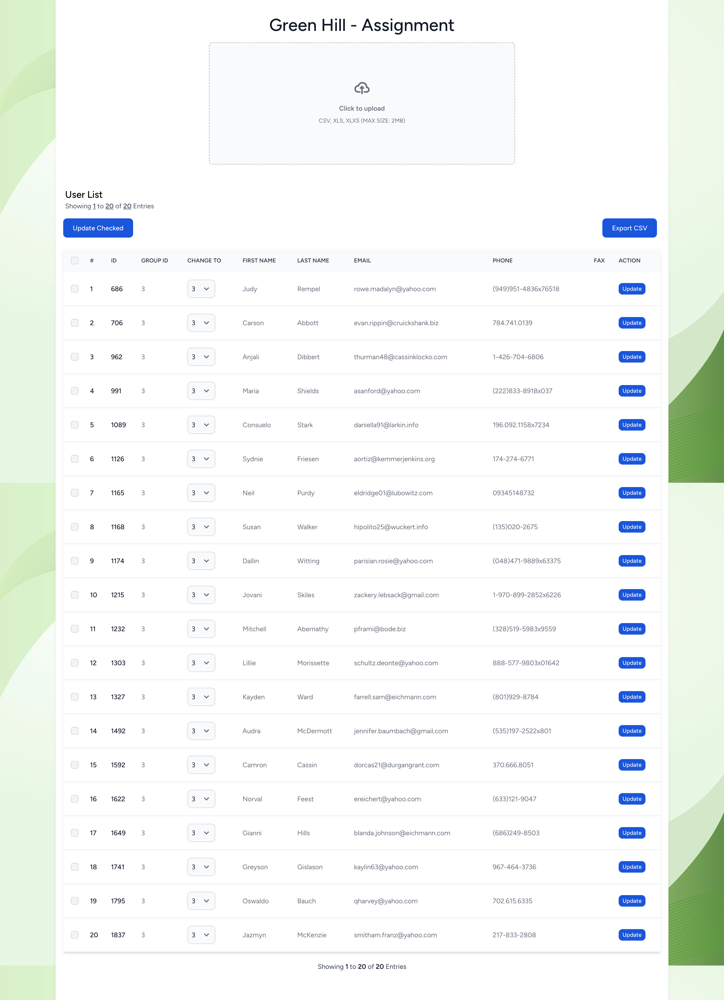

## About this project
This is an assignment from Green Hill Media Company.

## Stack:
- Backend:
    - PHP(Laravel)
    - MYSQL
    - Redis
- Frontend:
    - Breeze and Vue <- Breeze Laravel


## Setup
In this project, we will use docker for the development process. In particular, Laravel has a package that helps us to easily manage and set it up. And it's name is [Sail](https://laravel.com/docs/10.x/sail).
- [Install docker](https://docs.docker.com/engine/install/)
- Copy .env.example to .env and start filling in the values.
  ```shell
    cp .env.example .env
    ```
- Run below commands:
  ```shell
    docker-compose up -d
    docker-compose run laravel.test composer install
    ./vendor/bin/sail up --build
    ./vendor/bin/sail php artisan key:generate
    ./vendor/bin/sail npm install
    ./vendor/bin/sail npm run build
    ```

## Result Screenshot
- URL: http://localhost
  

### Route List
```text
  GET|HEAD  api/members ............................ UserController@getMembers
  PATCH     api/members ............................ UserController@bulkUpdate
  GET|HEAD  api/members/download ..................... UserController@download
  PUT       api/members/{id} ........................... UserController@update
  POST      api/upload ............................... UploadController@upload
```

### Reference sources
- **[Laravel 11.x](https://laravel.com/docs/11.x)**
- **[Vite](https://vitejs.dev/)**
- **[Breeze and React / Vue](https://laravel.com/docs/10.x/starter-kits#breeze-and-inertia)**
- **[Pinia](https://pinia.vuejs.org/)**


## Contact
- Full Name: Dang Nghia
- Email: dangnghia25197@gmail.com
- LinkedIn: https://www.linkedin.com/in/dangnghia
